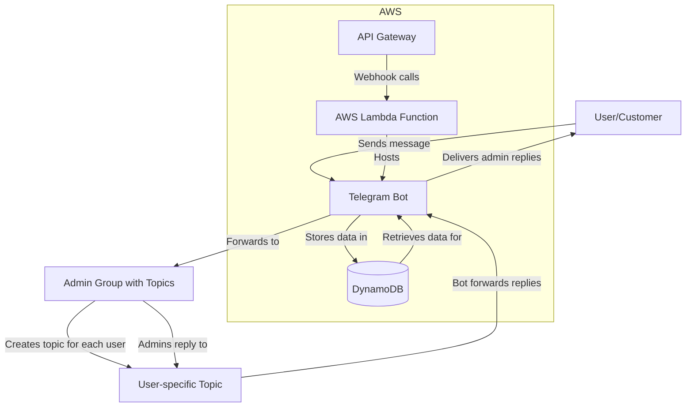

# Telegram Forwarder Bot

[](https://wakatime.com/badge/user/a0b906ce-b8e7-4463-8bce-383238df6d4b/project/6a20ebdb-2180-45e8-b924-c7ca363bbf5b)

[](https://codecov.io/gh/ragaeeb/forwarder-bot)
[](https://core.telegram.org/bots/api)
[](https://github.com/ragaeeb/forwarder-bot/actions/workflows/build.yml) 


A serverless Telegram bot that forwards messages between users and a private admin group with topics. Perfect for businesses, support teams, and communities that want to provide customer service while keeping administrator identities private.

## Features

### Core Functionality

- Users can send messages to the bot, which forwards them to your private Telegram group
- For each unique user, the bot creates a dedicated topic in your group
- Group admins can reply to user messages, and the bot forwards responses back to the user
- Admin identities remain private - all responses appear to come from the bot
- Edits to messages are detected and forwarded

### Message Support

- Text messages
- Photos with captions
- Documents/files with captions
- Video messages
- Voice notes

### Technical Features

- Completely serverless architecture using AWS Lambda and API Gateway
- Messages and thread relationships stored in DynamoDB for persistence
- Customizable welcome, acknowledgment, and error messages
- Easy configuration and setup process
- Comprehensive test coverage
- Developed with TypeScript for type safety

## Architecture Overview



## Prerequisites

- Bun `v1.2.5` or later
- An AWS account for serverless deployment
- A Telegram bot token (obtained from [@BotFather](https://t.me/BotFather))
- A Telegram group with topics enabled
- Serverless Framework (optional for development)

## Setup Instructions

### 1. Create a Telegram Bot

1. Talk to [@BotFather](https://t.me/BotFather) on Telegram
2. Use the `/newbot` command to create a new bot
3. Follow the instructions and save your bot token
4. Enable these settings for your bot (commands in BotFather):
    - `/setprivacy` - Disable privacy mode to allow the bot to see all messages
    - `/setjoingroups` - Enable join groups to allow the bot to be added to groups

### 2. Create a Telegram Group with Topics

1. Create a new group in Telegram
2. Go to group settings → Advanced → Enable "Topics"
3. Add your bot to the group as an administrator with these permissions:
    - Manage topics
    - Send messages
    - Delete messages
    - Read messages

### 3. Set Up Your Development Environment

1. Clone the repository:

    ```bash
    git clone https://github.com/yourusername/telegram-forwarder-bot.git
    cd telegram-forwarder-bot
    ```

2. Install dependencies:

    ```bash
    bun install
    ```

3. Create a `.env` file in the project root:

    ```
    BOT_TOKEN=your_telegram_bot_token
    SECRET_TOKEN=your_randomly_generated_secret  # Create a random token for webhook security
    TABLE_NAME=telegram-forwarder-bot-table      # Optional, defaults to this value
    ```

    Generate a random secret token with:

    ```bash
    bun run node -e "console.log(crypto.randomUUID())"
    ```

### 4. Deploy to AWS

#### Option A: Manual Deployment

1. Configure AWS credentials:

    ```bash
    aws configure
    ```

2. Deploy using Serverless Framework:

    ```bash
    bun run deploy
    ```

3. After successful deployment, register the webhook URL:
    ```bash
    bun run register
    ```

#### Option B: GitHub Actions Deployment

1. Set up the following secrets in your GitHub repository:

    - `AWS_ACCESS_KEY_ID`
    - `AWS_SECRET_ACCESS_KEY`
    - `BOT_TOKEN`
    - `SECRET_TOKEN`
    - `SERVERLESS_ORG` (optional)
    - `SERVERLESS_APP` (optional)
    - `SERVERLESS_SERVICE` (optional)

2. Trigger the "Deploy to AWS" workflow in the GitHub Actions tab

The workflow will:

- Build and test the application
- Deploy to AWS
- Configure the webhook automatically

### 5. Set Up the Bot in Your Group

1. After running the `register` command, you'll see a command to run in your Telegram group:

    ```
    Let the admin create a Telegram group, enable Topics, add the bot in there as an admin who can manage topics and messages, then send the following message in the group:
    /setup <hashed_token>
    ```

2. Send that `/setup <hashed_token>` command in your Telegram group
3. The bot will confirm setup success

## Local Development

1. Run the bot in development mode:

    ```bash
    bun run dev
    ```

2. This will start a polling-based development server that processes updates locally
3. Any code changes will automatically restart the bot

## Usage

### For Users

1. Users start a conversation with your bot
2. Send any message to the bot
3. The bot will respond with a welcome message
4. All subsequent messages will be forwarded to your admin group

### For Admins

1. Each user conversation appears as a topic in your admin group
2. Reply to any forwarded message to respond to the user
3. Your identity remains private - users only see replies from the bot
4. Photos and documents can be sent as responses

### Customization Commands

Run these commands in your admin group to customize the bot's messages:

- `/greeting <text>` - Set the welcome message when users start the bot
- `/ack <text>` - Set the acknowledgment message when users send messages
- `/failure <text>` - Set the error message when message forwarding fails

## Advanced Configuration

### Environment Variables

| Variable              | Description                           | Required | Default                      |
| --------------------- | ------------------------------------- | -------- | ---------------------------- |
| BOT_TOKEN             | Telegram Bot API token                | Yes      | -                            |
| SECRET_TOKEN          | Secret token for webhook security     | Yes      | -                            |
| TABLE_NAME            | DynamoDB table name                   | No       | telegram-forwarder-bot-table |
| AWS_ACCESS_KEY_ID     | AWS access key for deployment         | Yes\*    | -                            |
| AWS_SECRET_ACCESS_KEY | AWS secret key for deployment         | Yes\*    | -                            |
| AWS_REGION            | AWS region for deployment             | No       | us-east-1                    |
| SERVERLESS_ORG        | Serverless Framework organization     | No       | -                            |
| SERVERLESS_APP        | Serverless Framework application name | No       | -                            |
| SERVERLESS_SERVICE    | Serverless Framework service name     | No       | telegram-forwarder-bot       |

\*Required for deployment only

### Serverless Configuration

The `serverless.yml` file contains the AWS infrastructure configuration:

- **Lambda Function**: Configured with Node.js 22.x runtime on ARM64 architecture
- **API Gateway**: HTTP API endpoint to receive webhook calls
- **DynamoDB Table**: For storing user threads and message history
- **IAM Permissions**: Minimal required permissions for DynamoDB access

### Useful Management Commands

```bash
# View deployment logs
bun run serverless logs --function webhook --tail

# Remove the webhook (stop receiving updates)
bun run reset

# View the webhook setup information
bun run reveal

# Redeploy after changes
bun run deploy
```

## Security Considerations

The bot implements several security measures:

1. **Webhook Validation**: Uses a secret token to validate webhook requests
2. **Admin Authorization**: Only group admins can run setup commands
3. **Permission Testing**: Validates bot permissions during setup
4. **Token Hashing**: Setup tokens are hashed for added security

## Limitations and Known Issues

- Large media files are subject to Telegram's size limitations
- No web interface for message history (planned for future)

## Future Developments

The following features are planned for future releases:

1. **Admin Dashboard**: A web interface for admins to view message history across all users
2. **Rate Limiting**: Protection against spam or message flooding
3. **Additional Message Types**: Support for stickers, polls, locations, and other Telegram message types
4. **Media Storage**: S3 storage for message attachments
5. **Message Templates**: Predefined responses for common questions
6. **Performance Analytics**: CloudWatch metrics to monitor response times and message volumes
7. **Multi-admin Analytics**: Track which admin responded to which message
8. **Advanced Search**: Search functionality within user conversations
9. **Protection Customization**: Control whether you want to protect your messages from being forwarded or not.

## Contributing

Contributions are welcome! Please feel free to submit a Pull Request.

1. Fork the repository
2. Create your feature branch (`git checkout -b feature/amazing-feature`)
3. Commit your changes (`git commit -m 'Add some amazing feature'`)
4. Push to the branch (`git push origin feature/amazing-feature`)
5. Open a Pull Request

## License

This project is licensed under the MIT License - see the LICENSE file for details.

## Acknowledgments

- [gramio](https://github.com/gramiojs/gramio) for the Telegram Bot API client
- [Serverless Framework](https://www.serverless.com/) for the deployment tooling
